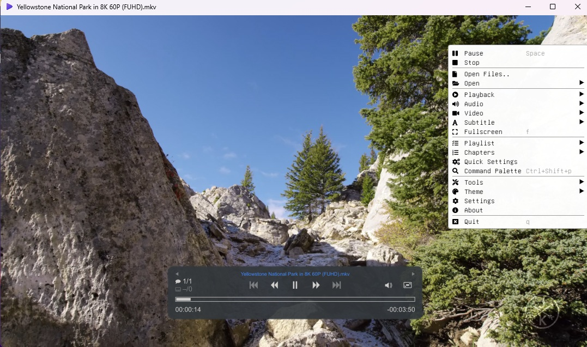

# ImPlay Clang

<p align="center">
	
</p>

This repository is a streamlined Windows build of ImPlay using the Clang toolchain instead of the default MSVC setup. It keeps the native app focused on a clean, working build path for modern Windows development.

## What this repo changes

- Brings the project onto the Clang/LLVM toolchain
- Addresses rendering problems seen at high resolutions, including 8K playback scenarios
- Updates the MPV integration to use the current library/tooling path needed for the app
- Keeps the project minimal and build-focused for easier maintenance

## Project goal

The goal is to provide a reliable, native ImPlay build that works well with Clang and the updated MPV stack while keeping the codebase lean and easier to compile.

## Build

From the repository root:

```powershell
cmake --preset x64-clang-release
cmake --build --preset x64-clang-release --config Release
```

This produces the Windows release binary for the Clang build.

## Notes

This repository is intended as a build-focused fork for the native ImPlay frontend. It prioritizes working compilation, rendering stability, and current MPV compatibility over unrelated experimental or extra project files.
